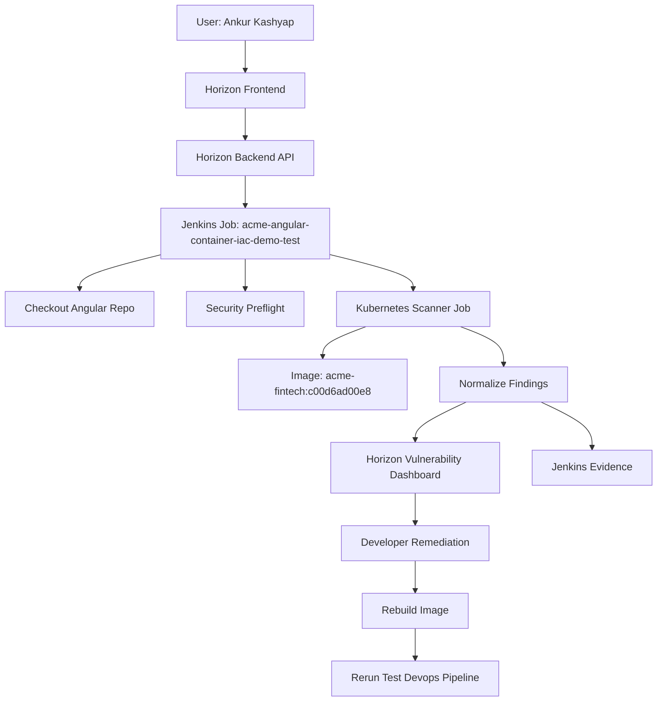

# Container, IaC, and Vulnerability Scan Demo Evidence

## Table of Contents

1. [Objective](#objective)
2. [Demo Scenario](#demo-scenario)
3. [Architecture Used in This Test](#architecture-used-in-this-test)
4. [Test Inputs](#test-inputs)
5. [Execution Steps Performed](#execution-steps-performed)
6. [Automated Product Fixes Completed During Test](#automated-product-fixes-completed-during-test)
7. [Final Test Result](#final-test-result)
8. [Findings Summary](#findings-summary)
9. [Findings Observed in the Dashboard](#findings-observed-in-the-dashboard)
10. [How a Developer Should Remediate](#how-a-developer-should-remediate)
11. [How to Validate the Fix](#how-to-validate-the-fix)
12. [Client Demo Walkthrough Script](#client-demo-walkthrough-script)
13. [Expected Client Questions and Answers](#expected-client-questions-and-answers)
14. [Evidence Checklist](#evidence-checklist)
15. [Summary](#summary)

## Objective

The objective of this test was to perform an end-to-end automated **container, IaC, secret, and vulnerability validation** using the Horizon AI DevSecOps **Test Devops Pipeline** against the Angular demo application.

The test demonstrates how a client can:

- Select an already-built application image.
- Run enterprise security validation through Horizon.
- Detect vulnerabilities and policy risks before promotion.
- See findings in the Horizon dashboard without exposing internal scanner names.
- Use the dashboard output to remediate and rerun the pipeline.

This document is written as a reusable client-demo guide and internal evidence record.

## Demo Scenario

The client has already used the Horizon **Devops Pipeline** to build and deploy an Angular application into a lower environment. The generated Docker image is now available in ECR. Before the client promotes the image further, the QA or DevSecOps team runs the **Test Devops Pipeline** to validate the image and related deployment risk.

The expected enterprise behavior is:

- The product checks the image and repository context.
- Findings are uploaded to the Horizon vulnerability dashboard.
- Critical and high findings block the pipeline.
- Developers review remediation guidance, fix the application or image, rebuild, and rerun.

## Architecture Used in This Test



The test followed the product model where the client keeps ownership of source code, container registry, Jenkins runtime, and artifact storage. Horizon receives normalized security findings and displays them using business-risk categories.

## Test Inputs

| Field | Value |
| --- | --- |
| Product URL | `https://horizonrelevance.com/pipeline/` |
| Pipeline | `Test Devops Pipeline` |
| Project Name | `acme-angular-container-iac-demo` |
| Project Type | `Angular` |
| Repository Type | `GitHub` |
| Repository URL | `https://github.com/ankur1825/horizon-demo-angular.git` |
| Branch | `main` |
| Image URI | `426946630837.dkr.ecr.us-east-1.amazonaws.com/acme-fintech:c00d6ad00e8` |
| Target Environment | `QA` |
| AWS Region | `us-east-1` |
| Artifact Bucket | `acme-fintech-devsecops` |
| Requested By | `ankur.kashyap` |
| Notification Email | `ankur.kashyap@horizonrelevance.com` |
| Container / IaC Vulnerability Scan | Enabled |
| Policy Validation | Enabled |
| Other Test Suites | Disabled for this focused run |

## Execution Steps Performed

### Step 1: Triggered Test Devops Pipeline

The test pipeline was triggered through the Horizon backend API, equivalent to clicking **CREATE TEST PIPELINE** in the UI.

Endpoint:

```text
POST https://horizonrelevance.com/pipeline/api/test/devops/pipeline
```

Result:

```text
Test Devops pipeline updated and triggered
Jenkins Job: acme-angular-container-iac-demo-test
```

### Step 2: Jenkins Job Was Created and Started

Jenkins job:

```text
https://horizonrelevance.com/jenkins/job/acme-angular-container-iac-demo-test/
```

Final clean validation build:

```text
https://horizonrelevance.com/jenkins/job/acme-angular-container-iac-demo-test/5/
```

### Step 3: Repository Checkout Was Completed

Jenkins checked out:

```text
https://github.com/ankur1825/horizon-demo-angular.git
Branch: main
Commit: 4ed18afcf65492764b21d6c2c4cd4c15433c04d2
```

### Step 4: Security Preflight Ran

The preflight stage checked the workspace for high-risk secret patterns and IaC files.

Observed result:

```text
No high-risk secret patterns detected.
Filesystem scan on Jenkins agent was skipped because the Trivy CLI was not installed on the Jenkins agent.
Image analysis handled the primary container vulnerability scan through a Kubernetes scanner job.
```

Archived preflight artifacts:

```text
security-preflight/filesystem-security.txt
security-preflight/preflight-failures.txt
security-preflight/secrets.txt
security-preflight/summary.json
```

### Step 5: Image Security Analysis Ran

The pipeline launched a Kubernetes scanner job to inspect the image:

```text
426946630837.dkr.ecr.us-east-1.amazonaws.com/acme-fintech:c00d6ad00e8
```

The scanner job used:

```text
ankur1825/horizon-trivy:1.1.3
```

The scan checked:

```text
vulnerability
secret
misconfiguration
```

### Step 6: Findings Were Uploaded to Dashboard

The scanner uploaded findings to:

```text
https://horizonrelevance.com/pipeline/api/upload_vulnerabilities
```

Observed upload result:

```text
Status: 200
Uploaded Count: 90
```

### Step 7: Pipeline Failed the Gate

The final build failed intentionally because blocking vulnerabilities were found.

Final clean build result:

```text
Build Number: 5
Result: FAILURE
Duration: 51 seconds
Reason: 35 blocking findings matched CRITICAL,HIGH
```

This is the correct enterprise behavior. The release should not continue until the critical and high findings are remediated or formally accepted through an exception process.

## Automated Product Fixes Completed During Test

During the test, the product surfaced a few implementation issues that were fixed before the final validation run.

### Fix 1: Scanner Image CLI Mismatch

Initial behavior:

```text
Error: No such option: --fail-on-severity
```

Root cause:

The Jenkins shared library passed enterprise scanner arguments, but the deployed scanner image was still using an older CLI.

Fix:

```text
Built and pushed: ankur1825/horizon-trivy:1.1.2
Committed Jenkins shared-library update: 34f6f51
```

### Fix 2: Reproducible Scanner Image Build

Initial behavior:

The scanner Dockerfile attempted to download a pinned filename from a moving `latest` release URL.

Fix:

The Dockerfile was updated to install a pinned scanner version reproducibly.

### Fix 3: Dashboard Upload Over Self-Signed HTTPS

Initial behavior:

The scanner found vulnerabilities but failed to upload because the internal endpoint used a self-signed certificate.

Fix:

The scanner upload client was aligned with the rest of the internal platform behavior and allowed internal certificate verification bypass for this environment.

```text
Built and pushed: ankur1825/horizon-trivy:1.1.3
Committed Jenkins shared-library update: fceb671
```

### Fix 4: Prompt Failure for Blocking Findings

Initial behavior:

Jenkins waited for Kubernetes job completion even when the scanner job had already failed by design due to blocking findings.

Fix:

The shared library now detects failed scanner jobs promptly, streams evidence, uninstalls the temporary Helm release, and fails the pipeline cleanly.

```text
Committed Jenkins shared-library update: 100bcfa
```

## Final Test Result

| Validation Area | Result |
| --- | --- |
| Product API trigger | Passed |
| Jenkins job creation/update | Passed |
| Jenkins build trigger | Passed |
| Repository checkout | Passed |
| Security preflight | Passed |
| Image scan job launch | Passed |
| Findings upload to dashboard | Passed |
| Gate enforcement | Passed |
| Final pipeline status | Failed intentionally due to blocking findings |

Final Jenkins build:

```text
Job: acme-angular-container-iac-demo-test
Build: 5
Result: FAILURE
URL: https://horizonrelevance.com/jenkins/job/acme-angular-container-iac-demo-test/5/
```

## Findings Summary

Final clean build `#5` produced:

| Metric | Count |
| --- | ---: |
| Total Findings | 90 |
| Critical | 6 |
| High | 29 |
| Medium | 46 |
| Low | 9 |
| Blocking Findings | 35 |
| Dashboard Category | Dependency Vulnerability |

Top affected components:

| Component | Finding Count |
| --- | ---: |
| `libssl3` | 19 |
| `libcrypto3` | 19 |
| `libpng` | 11 |
| `libxml2` | 7 |
| `libexpat` | 6 |
| `libcurl` | 5 |
| `curl` | 5 |
| `zlib` | 2 |
| `tiff` | 2 |
| `ssl_client` | 2 |

Sample blocking findings:

| Severity | Component | Finding ID | Fixed Version |
| --- | --- | --- | --- |
| Critical | `libxml2` | `CVE-2025-49796` | `2.13.9-r0` |
| Critical | `libxml2` | `CVE-2025-49794` | `2.13.9-r0` |
| Critical | `libcrypto3` | `CVE-2025-15467` | `3.3.6-r0` |
| Critical | `libcrypto3` | `CVE-2026-31789` | `3.3.7-r0` |
| Critical | `libssl3` | `CVE-2025-15467` | `3.3.6-r0` |
| Critical | `libssl3` | `CVE-2026-31789` | `3.3.7-r0` |
| High | `zlib` | `CVE-2026-22184` | `1.3.2-r0` |
| High | `nghttp2-libs` | `CVE-2026-27135` | `1.68.1` |
| High | `musl` | `CVE-2026-40200` | `1.2.5-r11` |
| High | `libxml2` | `CVE-2025-6021` | `2.13.9-r0` |

No high-risk committed secrets were detected during the repository preflight in this run.

No Terraform files were found in this Angular repository, so Terraform-specific IaC checks were not applicable for this run.

## Findings Observed in the Dashboard

Open the dashboard:

```text
https://horizonrelevance.com/pipeline/vulnerabilities
```

Recommended filters:

```text
Application: acme-angular-container-iac-demo
Build Number: 5
Category: Dependency Vulnerability
Severity: Critical or High
```

What to verify:

- Findings appear under the client-safe category **Dependency Vulnerability**.
- Findings do not expose internal scanner names as the primary dashboard category.
- Each finding includes affected component, installed version, fixed version, severity, remediation, Jenkins job, and build number.
- Jenkins traceability points back to build `#5`.

Example dashboard fields:

```text
Category: Dependency Vulnerability
Affected Component: libxml2
Vulnerability ID: CVE-2025-49796
Severity: CRITICAL
Fixed Version: 2.13.9-r0
Status: Open
Jenkins Job: acme-angular-container-iac-demo-test
Build Number: 5
```

## How a Developer Should Remediate

The primary issue is the container image base/runtime package set. The Angular application image is based on an Alpine/Nginx-style runtime that contains vulnerable OS packages.

### Remediation Option 1: Update the Base Image

If the Dockerfile uses a base image such as:

```dockerfile
FROM nginx:alpine
```

Update it to a newer pinned version:

```dockerfile
FROM nginx:1.29-alpine
```

or the latest approved internal enterprise base image:

```dockerfile
FROM <client-approved-registry>/secure-nginx:<approved-version>
```

Avoid unpinned tags in enterprise environments.

### Remediation Option 2: Patch Alpine Packages During Image Build

For Alpine-based images, add a package upgrade layer:

```dockerfile
RUN apk update && apk upgrade --no-cache
```

This updates vulnerable packages such as:

```text
libssl3
libcrypto3
libxml2
libpng
zlib
musl
curl
```

For production, prefer a patched base image from an approved enterprise image catalog.

### Remediation Option 3: Use a Hardened Internal Base Image

Enterprise clients should maintain approved base images that are:

- Regularly patched.
- Signed.
- Scanned.
- Pinned by digest.
- Published into the client-owned container registry.

The Angular app should inherit from the approved base image instead of pulling directly from public sources during production builds.

### Remediation Option 4: Rebuild and Retest

After updating the Dockerfile or base image:

1. Commit the Dockerfile change.
2. Run the Horizon Devops Pipeline again.
3. Build a new image tag.
4. Push the new image to ECR.
5. Run the Test Devops Pipeline again.
6. Confirm critical and high findings are reduced to zero or formally accepted.

## How to Validate the Fix

After remediation, rerun the same flow with the new image URI.

Expected clean or acceptable result:

```text
Critical Findings: 0
High Findings: 0
Pipeline Result: SUCCESS
Dashboard Status: No blocking findings
```

If medium or low findings remain, client policy determines whether the release can proceed.

Suggested release policy:

| Severity | Recommended Action |
| --- | --- |
| Critical | Block release |
| High | Block release |
| Medium | Allow with ticket or time-bound remediation depending on environment |
| Low | Track in backlog |
| Secret Exposure | Block release and rotate secret |
| Policy Violation | Block in QA, Stage, and Prod unless exception is approved |

## Client Demo Walkthrough Script

Use this flow in a client demo:

1. Open Horizon UI.
2. Explain that the app has already been built and deployed through the Devops Pipeline.
3. Open **Test Devops Pipeline**.
4. Enter the Angular repository and image URI.
5. Enable **Container / IaC Vulnerability Scan** and **Policy Validation**.
6. Run the pipeline.
7. Open Jenkins job `acme-angular-container-iac-demo-test`.
8. Show checkout, preflight, and image scan stages.
9. Explain that the build fails intentionally when blocking findings are present.
10. Open the vulnerability dashboard.
11. Filter by `acme-angular-container-iac-demo`.
12. Show critical/high findings grouped as **Dependency Vulnerability**.
13. Point out fixed versions and remediation guidance.
14. Explain the developer remediation: update base image or patch OS packages.
15. Explain rerun behavior: rebuild image, rerun scan, confirm critical/high findings are gone.

## Expected Client Questions and Answers

### Why did the pipeline fail?

It failed because the image had critical and high vulnerabilities. This is expected behavior. The product is enforcing a release gate.

### Does this mean the Angular code is bad?

Not necessarily. In this run, the findings were mostly container runtime packages from the image base layer, such as `libssl3`, `libcrypto3`, `libxml2`, and `libpng`.

### What does the developer fix?

The developer should update the Dockerfile base image, patch OS packages, or switch to a client-approved hardened base image.

### Where does QA see the evidence?

QA can see evidence in Jenkins and in the Horizon vulnerability dashboard:

```text
https://horizonrelevance.com/pipeline/vulnerabilities
```

### Are internal scanner names shown to the client?

The dashboard presents client-safe categories such as **Dependency Vulnerability**, **IaC Misconfiguration**, **Secret Exposure**, and **Policy Violation**. The client focuses on risk and remediation, not internal implementation details.

### Can this also find IaC issues?

Yes. If the repository contains Terraform, Kubernetes YAML, Helm charts, or rendered deployment manifests, the same pipeline can surface IaC and policy findings such as missing TLS, privileged containers, root containers, missing resource limits, and unsafe host mounts.

## Evidence Checklist

| Evidence Item | Status |
| --- | --- |
| Pipeline triggered from product | Complete |
| Jenkins job created/updated | Complete |
| Repository checkout completed | Complete |
| Security preflight completed | Complete |
| Image scan executed | Complete |
| Findings uploaded to dashboard | Complete |
| Pipeline failed due to blocking findings | Complete |
| Dashboard shows client-safe category | Complete |
| Developer remediation path documented | Complete |

## Summary

The automated container/IaC vulnerability demo successfully validated the Angular application image through the Horizon Test Devops Pipeline. The final clean build, Jenkins build `#5`, detected **90 findings**, including **6 critical** and **29 high** findings. The pipeline failed intentionally because **35 findings matched the blocking severity policy**.

This is the desired enterprise outcome. Horizon stopped an unsafe image from progressing, uploaded traceable findings into the dashboard, and provided remediation guidance that a developer can act on before rebuilding and retesting.
