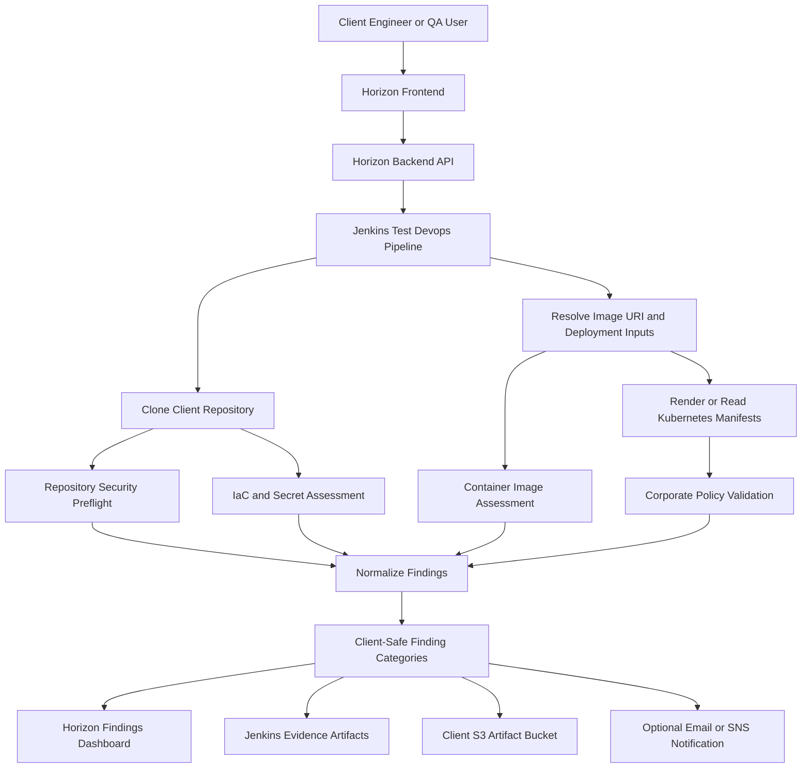

# Enterprise Vulnerability and Policy Findings Framework

## Table of Contents

1. [Introduction](#introduction)
2. [Purpose](#purpose)
3. [Where This Test Fits in the Horizon AI DevSecOps Platform](#where-this-test-fits-in-the-horizon-ai-devsecops-platform)
4. [Supported Application Types](#supported-application-types)
5. [Client-Safe Finding Categories](#client-safe-finding-categories)
6. [Conceptual Architecture](#conceptual-architecture)
7. [Enterprise Testing Model](#enterprise-testing-model)
8. [Inputs Required from the Client](#inputs-required-from-the-client)
9. [Step-by-Step Execution Through Horizon Test Devops Pipeline](#step-by-step-execution-through-horizon-test-devops-pipeline)
10. [What the Pipeline Validates](#what-the-pipeline-validates)
11. [What to Validate After Execution](#what-to-validate-after-execution)
12. [Result Artifacts and Evidence](#result-artifacts-and-evidence)
13. [Pass/Fail Criteria](#passfail-criteria)
14. [Angular Application Example](#angular-application-example)
15. [Spring Boot Application Example](#spring-boot-application-example)
16. [How Findings Appear in the Dashboard](#how-findings-appear-in-the-dashboard)
17. [Demo Script for Client Presentation](#demo-script-for-client-presentation)
18. [Troubleshooting](#troubleshooting)
19. [Best Practices](#best-practices)
20. [Summary](#summary)

## Introduction

The Enterprise Vulnerability and Policy Findings Framework validates whether an application, container image, Kubernetes deployment, and infrastructure-as-code content meet security expectations before the application is promoted to higher environments.

In the Horizon AI DevSecOps platform, this framework is executed through the **Test Devops Pipeline**. It can inspect source repository files, dependency manifests, container image metadata, Kubernetes manifests, Helm-rendered output, and deployment policies. The outcome is a client-facing set of security findings grouped by risk category, not by the internal scanning technology used by the platform.

This is important for enterprise clients because security teams usually do not want a product demo centered around the scanners. They want to understand the risk, impact, severity, affected component, remediation guidance, and whether the release should continue.

## Purpose

The purpose of this test is to answer practical security and release-readiness questions:

- Does the application contain known dependency vulnerabilities?
- Does the container image include vulnerable packages?
- Are secrets, tokens, keys, or credentials accidentally committed to the repository?
- Do Kubernetes manifests violate corporate deployment policies?
- Are containers running with unsafe privileges?
- Are required resource limits, labels, health checks, and security contexts configured?
- Are ingress, service, and workload settings aligned with enterprise guardrails?
- Should the release proceed, require remediation, or be blocked?

This framework helps QA, DevSecOps, platform engineering, and application teams produce repeatable security evidence without requiring clients to share source code with Horizon Relevance.

## Where This Test Fits in the Horizon AI DevSecOps Platform

Horizon separates application build, validation, and production promotion into separate pipeline flows:

- **Devops Pipeline** builds source code, creates a Docker image, pushes the image to the client container registry, publishes metadata, and deploys to a selected lower environment such as DEV or QA.
- **Test Devops Pipeline** performs post-build and post-deployment validation, including UI testing, API testing, performance testing, code quality testing, vulnerability checks, secret checks, IaC checks, and policy validation.
- **Prod Devops Pipeline** promotes validated artifacts into production with approvals and production deployment rules.

The vulnerability and policy framework belongs primarily in the **Test Devops Pipeline** because it validates artifacts that already exist:

- Source repository content
- Dependency manifests
- Docker image URI
- Kubernetes deployment metadata
- Helm-rendered manifests
- Runtime deployment configuration

It can also run as a preflight check inside the Devops Pipeline to stop obviously unsafe builds earlier in the lifecycle.

## Supported Application Types

This framework can be used across most modern application stacks.

| Application Type | Supported | Typical Validation Scope |
| --- | --- | --- |
| Angular | Yes | `package.json`, lock files, Dockerfile, Nginx image, Kubernetes manifests |
| React | Yes | `package.json`, lock files, Dockerfile, frontend image, Kubernetes manifests |
| Spring Boot | Yes | Maven or Gradle dependencies, Java base image, container image, Kubernetes manifests |
| Node.js | Yes | npm dependencies, Dockerfile, Node runtime image, Kubernetes manifests |
| WebComponent | Yes | JavaScript dependencies, Dockerfile, image, deployment manifests |
| Python API | Yes | pip dependencies, Dockerfile, image, Kubernetes manifests |
| Go service | Yes | Go modules, Dockerfile, image, Kubernetes manifests |
| Terraform | Yes | IaC misconfiguration checks |
| Helm charts | Yes | Rendered Kubernetes manifest policy checks |
| Kubernetes YAML | Yes | Workload, service, ingress, and security context checks |

The framework is application-agnostic. The most important requirement is that the pipeline can access either the repository, the image URI, the deployment manifests, or a combination of these.

## Client-Safe Finding Categories

Horizon intentionally presents findings by business risk category instead of exposing scanner or product names. This keeps the client experience focused on security outcomes.

| Dashboard Category | Meaning |
| --- | --- |
| Dependency Vulnerability | A vulnerable library, OS package, framework, or application dependency was found |
| Container Vulnerability | A vulnerability exists in the container image or runtime package set |
| IaC Misconfiguration | Infrastructure or Kubernetes configuration may be unsafe or noncompliant |
| Secret Exposure | A secret, credential, token, key, or high-risk sensitive value may be exposed |
| Code Security Finding | Source code or quality analysis identified a security-relevant issue |
| Static Code Security Finding | Static application security testing identified a weakness |
| Policy Violation | A corporate deployment rule or Kubernetes guardrail was violated |
| Security Finding | General fallback category when a finding cannot be mapped more specifically |

The dashboard should not show internal tool names as the primary client-facing classification. For example, the client should see **Secret Exposure**, **IaC Misconfiguration**, or **Policy Violation**, not the internal engine that produced the finding.

## Conceptual Architecture



The platform is designed for a client-hosted model. Jenkins runs inside the client-controlled environment, accesses the client repository with client credentials, pushes evidence to the client artifact bucket, and reports summarized findings to the Horizon dashboard.

## Enterprise Testing Model

Enterprise clients usually perform vulnerability and policy testing in layers.

| Layer | Purpose | Example |
| --- | --- | --- |
| Repository Preflight | Catch vulnerable dependencies, secrets, and IaC issues before deployment | Scan source tree and manifests |
| Image Assessment | Validate built container image before runtime promotion | Scan image URI and digest |
| Kubernetes Policy Validation | Enforce corporate deployment standards | Security context, labels, limits, ingress TLS |
| Evidence Publishing | Keep release evidence for audit and traceability | Jenkins artifacts and S3 uploads |
| Dashboard Visibility | Show findings in business-risk language | Vulnerability dashboard categories |
| Release Gate | Pass or fail the pipeline based on severity and policy | Block critical findings |

This layered model is more robust than only scanning source code or only scanning images. It catches issues across the full software delivery lifecycle.

## Inputs Required from the Client

The Test Devops Pipeline requires enough information to locate the application artifact and understand the target environment.

| Input | Required | Example |
| --- | --- | --- |
| Project Name | Yes | `acme-angular-main-ank` |
| Project Type | Yes | `Angular`, `SpringBoot`, `Node.js` |
| Repository URL | Usually | `https://github.com/client/app.git` |
| Branch | Usually | `main`, `develop`, `release/1.0` |
| Image URI | Recommended | `123456789012.dkr.ecr.us-east-1.amazonaws.com/app:abc123` |
| Deployed App URL | Optional | Used for Selenium, Newman, or JMeter tests |
| Environment | Yes | `DEV`, `QA`, `STAGE`, `PROD` |
| AWS Region | Yes | `us-east-1` |
| Artifact S3 Bucket | Yes | `client-devsecops-artifacts` |
| Client AWS Role ARN | Enterprise | Cross-account access to client resources |
| Non-Prod or Target Role ARN | Enterprise | Environment-specific execution role |
| SNS Topic ARN | Optional | Notification target |

For a simple demo, provide repository URL, branch, image URI, environment, and artifact bucket. For enterprise client-hosted execution, provide client-controlled roles and environment-specific cluster settings.

## Step-by-Step Execution Through Horizon Test Devops Pipeline

### Step 1: Build and Deploy the Application

Run the **Devops Pipeline** first.

Expected output:

- Docker image is built.
- Image is pushed to the client container registry.
- Image tag and digest are generated.
- Deployment metadata is written.
- Application is deployed to DEV or QA.
- `image.json` and related evidence are stored in the client artifact bucket.

### Step 2: Open the Horizon Product UI

Open:

```text
https://horizonrelevance.com/pipeline/
```

Login with an authorized user.

### Step 3: Select Test Devops Pipeline

In the **Service** dropdown, select:

```text
Test Devops Pipeline
```

### Step 4: Complete Test Target Inputs

Use the application values from the build pipeline.

Example for Angular:

```text
Project Name: acme-angular-main-ank
Project Type: Angular
Repository Type: GitHub
Repository URL: https://github.com/ankur1825/horizon-demo-angular.git
Branch: main
Image URI: 426946630837.dkr.ecr.us-east-1.amazonaws.com/acme-fintech:c00d6ad00e8
Deployed App URL: optional for vulnerability-only scan
```

### Step 5: Enable Security and Policy Gates

Enable the security checks required for the run.

Recommended first run:

```text
Container / IaC Vulnerability Scan: On
Policy Validation: On
```

Optional combined run:

```text
Code Quality Scan: On
API Regression Test: On
Performance Test: On
UI End-to-End Test: On
```

For the cleanest demo, start with vulnerability and policy validation only. Then run a second combined test to demonstrate broader quality gates.

### Step 6: Complete Execution and Results Inputs

Example:

```text
Environment: QA
AWS Region: us-east-1
Artifact S3 Bucket: acme-fintech-devsecops
Client AWS Role ARN: optional for internal demo
Non-Prod AWS Role ARN: optional for internal demo
Email Address: qa.engineer@client.com
Send SNS Notification: enabled if topic exists
SNS Topic ARN: arn:aws:sns:us-east-1:123456789012:client-devsecops-alerts
```

### Step 7: Create the Pipeline

Click:

```text
CREATE TEST PIPELINE
```

Expected result:

- Horizon backend receives the request.
- Jenkins job is created or reused.
- Jenkins starts a new build.
- The selected checks run.
- Findings are normalized into client-safe categories.
- Evidence is archived and uploaded.
- Dashboard receives findings.

### Step 8: Monitor Jenkins

Open the Jenkins job from the pipeline response or Jenkins UI.

Validate these stages:

- Checkout source
- Resolve inputs
- Repository security preflight
- Container image assessment
- Kubernetes policy validation
- Publish findings
- Archive evidence
- Send notification

The exact stage names may differ by implementation, but the evidence flow should remain the same.

### Step 9: Review the Findings Dashboard

Open:

```text
https://horizonrelevance.com/pipeline/vulnerabilities
```

Validate that findings are grouped by risk category, not by internal scanner name.

Expected categories:

- Dependency Vulnerability
- Container Vulnerability
- IaC Misconfiguration
- Secret Exposure
- Policy Violation
- Security Finding

## What the Pipeline Validates

### Dependency and Package Risk

The pipeline checks application and image dependencies for known vulnerabilities.

Examples:

- Vulnerable npm package
- Vulnerable Maven dependency
- Vulnerable OS package inside the image
- Outdated runtime dependency

### Secret Exposure

The pipeline checks repository content for secret-like values.

Examples:

- Access key
- Private key
- Password in configuration
- Token in `.env`
- Hardcoded credential in source code

### IaC Misconfiguration

The pipeline checks infrastructure and deployment configuration.

Examples:

- Public ingress without TLS
- Overly permissive security group rule
- Unsafe Kubernetes workload settings
- Missing resource limits
- Missing labels needed for traceability

### Kubernetes Policy Validation

The pipeline checks corporate deployment guardrails.

Examples:

- Container runs as root
- Privileged container
- Host network enabled
- Host path mount
- Missing CPU or memory limits
- Missing readiness or liveness probe
- Image uses `latest` tag
- Image not pinned by digest
- Service uses external load balancer without approved annotation

## What to Validate After Execution

After the run completes, validate the following.

| Validation Area | Expected Result |
| --- | --- |
| Jenkins build | Build completed or failed based on configured gate |
| Evidence artifacts | JSON, summary, and logs archived in Jenkins |
| S3 artifacts | Evidence uploaded to the client artifact bucket |
| Dashboard | Findings visible under client-safe categories |
| Tool privacy | Dashboard does not expose internal scanner names as primary finding source |
| Severity | Critical and high findings clearly visible |
| Remediation | Each finding includes useful remediation or description |
| Traceability | Finding is tied to project, branch, build, image, or package |
| Release gate | Build fails when blocking policy or severity threshold is exceeded |

## Result Artifacts and Evidence

The pipeline should preserve evidence for audit and troubleshooting.

Typical Jenkins artifacts:

```text
security-preflight/filesystem-security.json
security-preflight/summary.json
security-preflight/dashboard-upload-status.txt
security-preflight/trivy-preflight-upload.json
opa-k8s-result.json
opa-k8s-upload.json
opa-k8s-exit-code.txt
rendered.yaml
opa-policies/**
```

Client-facing evidence should be interpreted as:

| Artifact | Purpose |
| --- | --- |
| `filesystem-security.json` | Raw repository, dependency, secret, and IaC assessment evidence |
| `summary.json` | Human-readable summary of scan results |
| `dashboard-upload-status.txt` | Confirms dashboard upload status |
| `opa-k8s-result.json` | Policy validation result |
| `opa-k8s-upload.json` | Dashboard upload payload for policy findings |
| `rendered.yaml` | Kubernetes manifest evaluated by policy rules |
| `opa-policies/**` | Policy bundle used for validation |

For client demos, focus on the summary, dashboard findings, and remediation. Raw artifacts are useful for auditors and engineering teams.

## Pass/Fail Criteria

Recommended default criteria:

| Condition | Recommended Action |
| --- | --- |
| Critical vulnerability | Fail pipeline |
| High vulnerability | Fail or require approval based on client policy |
| Secret exposure | Fail pipeline |
| Privileged container | Fail pipeline |
| Root container | Fail pipeline unless approved exception exists |
| Host network or host path | Fail pipeline |
| Missing resource limits | Fail or warn depending on maturity |
| Ingress without TLS | Fail for Stage and Prod, warn for DEV |
| Image using `latest` tag | Fail for QA, Stage, and Prod |
| Missing labels | Warn in DEV, fail in higher environments if required |

Horizon should let enterprise clients tune thresholds by environment. DEV may allow warnings. QA, Stage, and Prod should enforce stricter release gates.

## Angular Application Example

Example repository:

```text
https://github.com/ankur1825/horizon-demo-angular.git
```

Recommended test inputs:

```text
Project Name: acme-angular-main-ank
Project Type: Angular
Repository URL: https://github.com/ankur1825/horizon-demo-angular.git
Branch: main
Image URI: 426946630837.dkr.ecr.us-east-1.amazonaws.com/acme-fintech:<commit-tag>
Environment: QA
Artifact S3 Bucket: acme-fintech-devsecops
```

Expected validation:

- npm dependency findings are categorized as Dependency Vulnerability.
- Docker or image package findings are categorized as Container Vulnerability.
- Kubernetes deployment issues are categorized as Policy Violation or IaC Misconfiguration.
- Any exposed test secrets are categorized as Secret Exposure.
- Dashboard should not display internal scanner names as the client-facing category.

## Spring Boot Application Example

Example repository:

```text
https://github.com/ankur1825/horizon-demo-springboot
```

Recommended test inputs:

```text
Project Name: acme-springboot-main
Project Type: SpringBoot
Repository URL: https://github.com/ankur1825/horizon-demo-springboot.git
Branch: main
Image URI: 426946630837.dkr.ecr.us-east-1.amazonaws.com/acme-fintech:<commit-tag>
Environment: QA
Artifact S3 Bucket: acme-fintech-devsecops
```

Expected validation:

- Maven or Gradle dependency findings are categorized as Dependency Vulnerability.
- Java runtime and OS package findings are categorized as Container Vulnerability.
- Kubernetes manifest issues are categorized as Policy Violation.
- Configuration leaks are categorized as Secret Exposure.

## How Findings Appear in the Dashboard

The dashboard should focus on client risk:

```text
Category: Dependency Vulnerability
Severity: HIGH
Component: lodash
Finding ID: CVE-xxxx-yyyy
Remediation: Upgrade to a safe version
Project: acme-angular-main-ank
Branch: main
Image: client-registry/app:commit-tag
Build: Jenkins build number
```

The dashboard should not focus on the internal tool:

```text
Tool: ScannerName
Plugin: InternalPolicyEngine
```

This design makes Horizon look like an enterprise DevSecOps platform, not a wrapper around individual tools.

## Demo Script for Client Presentation

Use this flow for a 20 to 30 minute client demo.

1. Explain that the client owns the source code, registry, clusters, and artifact bucket.
2. Show the Devops Pipeline building and deploying an application to QA.
3. Copy the image URI and deployed metadata from the build output.
4. Open the Test Devops Pipeline.
5. Select the same project and branch.
6. Paste the image URI.
7. Enable vulnerability and policy checks.
8. Run the pipeline.
9. Open Jenkins and show the validation stages.
10. Show archived evidence.
11. Open the vulnerability dashboard.
12. Explain findings by category: Dependency Vulnerability, IaC Misconfiguration, Secret Exposure, Policy Violation.
13. Show one failed finding and explain remediation.
14. Explain how release promotion can be blocked until remediation is complete.
15. Explain that internal scanning engines are abstracted from the client-facing dashboard.

## Troubleshooting

### No Findings Appear in the Dashboard

Check:

- Jenkins stage completed the upload step.
- Backend `/upload_vulnerabilities` endpoint is reachable.
- Project name and build number were included in payload.
- The dashboard filter is not hiding the category.
- Backend deployment is running the latest image.

### Findings Show Internal Tool Names

Check:

- Jenkins shared library is loaded from `main`.
- Jenkins job pulled the latest shared library commit.
- Backend is running the version with source normalization.
- Dashboard is using the latest frontend image.
- Existing old findings may still contain previous source values until rescanned or normalized.

### Policy Validation Fails Unexpectedly

Check:

- Rendered Kubernetes manifest exists.
- Image tag, labels, namespace, and resource limits are present.
- Security context is configured.
- Environment-specific exceptions are documented and approved.

### Image Scan Cannot Pull Image

Check:

- Image URI is correct.
- Jenkins has permissions to assume the client role.
- ECR repository policy allows read access.
- AWS region matches the registry region.
- Image tag exists.

### S3 Upload Fails

Check:

- Artifact bucket exists.
- Jenkins role can write to the bucket.
- Bucket policy allows the role.
- KMS permissions are configured if bucket encryption uses a customer-managed key.

## Best Practices

- Use short commit-based image tags and also publish `latest` only where appropriate.
- Store scan evidence in a client-owned S3 artifact bucket.
- Fail fast for secret exposure and critical vulnerabilities.
- Require explicit exception approval for root, privileged, host network, and host path deployments.
- Use environment-specific gates: stricter for QA, Stage, and Prod.
- Keep dashboard language focused on risk and remediation.
- Avoid exposing internal scanner names in client-facing reports.
- Include project, branch, image, digest, build number, and environment on every finding.
- Keep false positive handling auditable with expiration dates.
- Review policy rules quarterly with security, platform, and application teams.

## Summary

The Enterprise Vulnerability and Policy Findings Framework gives clients a repeatable way to validate application, container, infrastructure, and Kubernetes security before release promotion. It supports Angular, Spring Boot, Node.js, WebComponent, API, and microservice workloads. It produces evidence in Jenkins and the client artifact bucket, while the Horizon dashboard presents findings in client-safe categories such as Dependency Vulnerability, IaC Misconfiguration, Secret Exposure, and Policy Violation.

This keeps the product focused on enterprise risk, remediation, governance, and release confidence instead of exposing internal implementation details.
