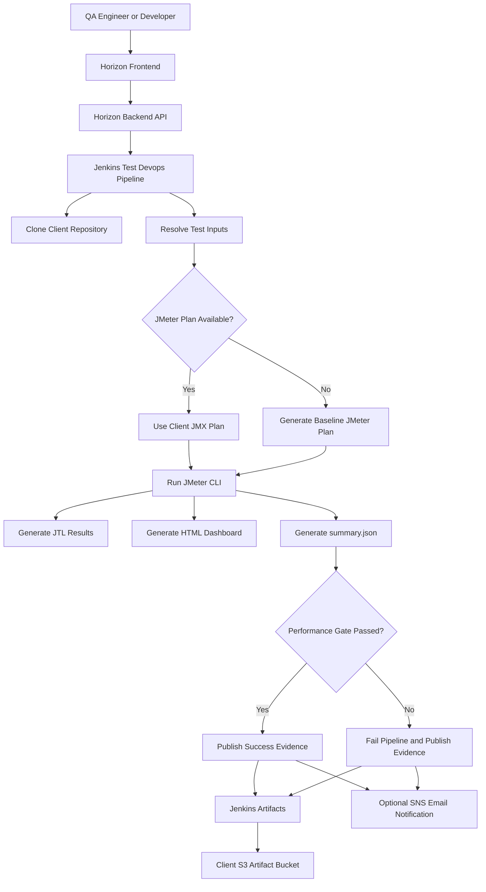

# JMeter Performance Testing Framework

## Table of Contents

1. [Introduction](#introduction)
2. [Purpose](#purpose)
3. [Where JMeter Fits in the Horizon AI DevSecOps Platform](#where-jmeter-fits-in-the-horizon-ai-devsecops-platform)
4. [Supported Application Types](#supported-application-types)
5. [Conceptual Architecture](#conceptual-architecture)
6. [Enterprise Testing Model](#enterprise-testing-model)
7. [JMeter Execution Modes](#jmeter-execution-modes)
8. [Inputs Required from the Client](#inputs-required-from-the-client)
9. [Step-by-Step Execution Through Horizon Test Devops Pipeline](#step-by-step-execution-through-horizon-test-devops-pipeline)
10. [Recommended Test Profiles](#recommended-test-profiles)
11. [What to Validate After Execution](#what-to-validate-after-execution)
12. [Result Artifacts and Evidence](#result-artifacts-and-evidence)
13. [Quality Gates and Pass/Fail Criteria](#quality-gates-and-passfail-criteria)
14. [Angular Application Example](#angular-application-example)
15. [Spring Boot Application Example](#spring-boot-application-example)
16. [How Clients Should Design JMeter Test Plans](#how-clients-should-design-jmeter-test-plans)
17. [Demo Script for Client Presentation](#demo-script-for-client-presentation)
18. [Troubleshooting](#troubleshooting)
19. [Best Practices](#best-practices)
20. [Summary](#summary)

## Introduction

Apache JMeter is an open-source performance testing tool used to measure how an application behaves under load. It can simulate multiple users calling a web application, REST API, backend service, gateway, or internal service endpoint. JMeter records response times, error rates, throughput, latency, and other performance indicators that help teams understand whether an application is ready for QA, staging, or production traffic.

In the Horizon AI DevSecOps platform, JMeter is executed through the **Test Devops Pipeline** as an enterprise quality gate. This allows QA, DevOps, and platform teams to run repeatable performance tests against applications deployed through the Devops Pipeline or against any reachable application endpoint.

## Purpose

The purpose of JMeter testing is to answer practical engineering and business questions before software is promoted to higher environments:

- Can the application handle expected user traffic?
- Does the application respond within acceptable latency thresholds?
- Does the application fail under moderate or heavy load?
- Are there performance regressions after a new build?
- Does the frontend, API, or backend remain stable when multiple users access it at the same time?
- Can QA produce objective evidence before approving promotion to Stage or Production?

JMeter testing is not just a technical activity. It protects customer experience, production stability, and release confidence.

## Where JMeter Fits in the Horizon AI DevSecOps Platform

Horizon AI DevSecOps separates build, deployment, security validation, and test validation into clear pipeline flows:

- **Devops Pipeline** builds the application, creates a Docker image, pushes the image to ECR, writes deployment metadata, and deploys to a selected environment such as DEV or QA.
- **Test Devops Pipeline** executes post-deployment validation such as Selenium UI tests, Newman API tests, JMeter performance tests, SonarQube code quality scans, OPA policy validation, and vulnerability scans.
- **Prod Devops Pipeline** promotes validated artifacts into production environments after approvals and production checks.

JMeter belongs in the Test Devops Pipeline because performance testing should run against a real deployed endpoint, not only against source code.

## Supported Application Types

JMeter can be used with any application that exposes HTTP or HTTPS endpoints.

| Application Type | Supported | Typical JMeter Target |
| --- | --- | --- |
| Angular | Yes | Deployed UI route, static asset route, API route behind the UI |
| React | Yes | Deployed UI route, API route behind the UI |
| Spring Boot | Yes | REST endpoints, actuator health endpoint, business APIs |
| Node.js | Yes | Express/NestJS APIs, health endpoints, backend services |
| WebComponent | Yes | Deployed web route and associated backend APIs |
| API Gateway | Yes | Public or private gateway URL |
| Microservice | Yes | Service URL, ingress URL, load balancer URL, or internal Kubernetes DNS |
| Non-HTTP workloads | Limited | Requires custom JMeter plugin or different test tool |

For Angular applications, JMeter usually validates the deployed UI route and backend API routes used by the UI. For Spring Boot applications, JMeter usually validates REST APIs, actuator endpoints, and business transaction endpoints.

## Conceptual Architecture



The platform does not require clients to share source code with Horizon Relevance. In a client-hosted model, Jenkins runs inside the client-controlled environment, clones the client repository using client-controlled credentials, tests client-owned endpoints, and stores results in the client-owned S3 artifact bucket.

## Enterprise Testing Model

Enterprise QA teams normally perform performance testing in multiple layers:

| Test Layer | Purpose | Example |
| --- | --- | --- |
| Smoke Performance Test | Confirm endpoint responds under small load | 5 users, 1 minute |
| Baseline Test | Establish normal response profile | 10 to 25 users |
| Load Test | Validate expected business traffic | 50 to 250 users |
| Stress Test | Identify breaking point | Increase users until errors rise |
| Regression Performance Test | Compare current build to previous build | Run same test every release |
| Pre-Production Gate | Validate before production approval | Controlled Stage or Pre-Prod traffic |

The current Horizon implementation supports a baseline performance gate directly from the UI and can also execute a client-owned JMeter `.jmx` file for advanced scenarios.

## JMeter Execution Modes

The Horizon Test Devops Pipeline supports two JMeter execution modes.

### Mode 1: Generated Baseline Plan

Use this mode when the client has not created a JMeter test plan yet.

The user provides:

- Deployed App URL
- Thread count
- Ramp seconds
- Loop count
- Error threshold
- Average response time threshold
- P95 response time threshold

The pipeline generates a JMeter plan automatically and performs a baseline HTTP GET test against the deployed endpoint.

This is useful for:

- Demo scenarios
- First-time onboarding
- Quick QA validation
- Verifying application availability under light load

### Mode 2: Client-Owned JMX Plan

Use this mode when the client already has performance scenarios.

The client stores a JMeter `.jmx` test plan in the application repository, usually under one of these paths:

```text
tests/jmeter/test.jmx
tests/jmeter/performance.jmx
tests/jmeter/load-test.jmx
qe/performance/E2E_performance.jmx
```

The pipeline automatically discovers these paths. The user can also provide an explicit **JMeter Test Plan Path** in the UI.

This is useful for:

- Real business transaction testing
- Login/search/checkout workflows
- Multi-endpoint API load testing
- Enterprise QA regression suites
- Pre-production approval testing

## Inputs Required from the Client

### Required Inputs

| Field | Description | Example |
| --- | --- | --- |
| Project Name | Logical application name | `acme-angular-main-ank` |
| Project Type | Application type | `Angular` or `SpringBoot` |
| Repository Type | Source control provider | `GitHub` |
| Repository URL | Client application repository | `https://github.com/ankur1825/horizon-demo-angular.git` |
| Branch | Branch to test | `main` |
| Deployed App URL | URL or internal DNS of deployed app | `http://service.namespace.svc.cluster.local` |
| Artifact S3 Bucket | Bucket for test evidence | `acme-fintech-devsecops` |

### JMeter-Specific Inputs

| Field | Description | Recommended Demo Value |
| --- | --- | --- |
| JMeter Test Plan Path | Optional path to `.jmx` file | Blank for generated baseline |
| Threads | Number of concurrent virtual users | `10` |
| Ramp Seconds | Time to ramp all users | `30` |
| Loops | Requests per thread | `5` |
| Max Error % | Allowed percentage of failed samples | `1` |
| Max Avg ms | Allowed average response time | `2000` |
| Max P95 ms | Allowed p95 response time | `5000` |

## Step-by-Step Execution Through Horizon Test Devops Pipeline

### Step 1: Deploy the Application

Before running JMeter, deploy the application through the Devops Pipeline.

For Angular:

```text
Service: Devops Pipeline
Project Type: Angular
Repository URL: https://github.com/ankur1825/horizon-demo-angular.git
Branch: main
Target Environment: DEV or QA
Namespace: acme-fintech-angular
```

For Spring Boot:

```text
Service: Devops Pipeline
Project Type: SpringBoot
Repository URL: https://github.com/ankur1825/horizon-demo-springboot.git
Branch: main
Target Environment: DEV or QA
Namespace: acme-fintech-springboot
```

Confirm that the application pod, service, and route are running before starting JMeter.

### Step 2: Confirm the Target URL

The JMeter test needs a reachable URL. This can be:

- Public ingress URL
- Internal Kubernetes DNS
- API Gateway URL
- Load balancer URL
- Service mesh route

Example internal Kubernetes DNS:

```text
http://acme-angular-main-ank-acme-angular-main-ank.acme-fintech-angular.svc.cluster.local
```

Example public endpoint:

```text
https://qa.acme-fintech.com
```

### Step 3: Open the Horizon Platform

Open:

```text
https://horizonrelevance.com/pipeline/
```

Log in with your LDAP-backed Horizon user.

### Step 4: Select Test Devops Pipeline

In the Service dropdown, select:

```text
Test Devops Pipeline
```

### Step 5: Enter Test Target Details

Complete the test target fields:

```text
Project Name: acme-angular-main-ank
Project Type: Angular
Repository Type: GitHub
Repository URL: https://github.com/ankur1825/horizon-demo-angular.git
Branch: main
Image URI: optional for JMeter-only test
Deployed App URL: http://acme-angular-main-ank-acme-angular-main-ank.acme-fintech-angular.svc.cluster.local
```

For Spring Boot, use the Spring Boot repository and deployed service URL.

### Step 6: Enable JMeter Load Testing

In Security & Quality Gates, enable:

```text
JMeter Load Testing: On
```

Disable other tools for the first JMeter-only run unless the demo requires a combined test.

### Step 7: Configure JMeter Parameters

For a baseline demo:

```text
JMeter Test Plan Path: blank
Threads: 10
Ramp Seconds: 30
Loops: 5
Max Error %: 1
Max Avg ms: 2000
Max P95 ms: 5000
```

For a client-owned JMX plan:

```text
JMeter Test Plan Path: tests/jmeter/test.jmx
Threads: 25
Ramp Seconds: 60
Loops: 10
Max Error %: 1
Max Avg ms: 1500
Max P95 ms: 4000
```

### Step 8: Configure Execution and Results

Complete:

```text
Environment: QA
AWS Region: us-east-1
Artifact S3 Bucket: acme-fintech-devsecops
Client AWS Role ARN: optional based on client-hosted setup
Non-Prod AWS Role ARN: optional based on client-hosted setup
Email Address: QA or release owner email
Send SNS Notification: optional
SNS Topic ARN: required only if SNS is enabled
```

### Step 9: Create Test Pipeline

Click:

```text
CREATE TEST PIPELINE
```

The Horizon backend creates or updates a Jenkins job and triggers the test run.

### Step 10: Monitor Jenkins

Open Jenkins and monitor the generated job.

The JMeter stage is displayed as:

```text
Performance Load Testing
```

Expected pipeline actions:

1. Clone repository.
2. Resolve JMeter parameters.
3. Use client JMX plan if provided, otherwise generate a baseline plan.
4. Install or locate JMeter CLI.
5. Run JMeter in non-GUI mode.
6. Generate JTL, HTML, log, and summary files.
7. Apply pass/fail thresholds.
8. Archive results and upload evidence to S3.

## Recommended Test Profiles

### Demo Profile

Use this for product demos and first-time validation.

| Parameter | Value |
| --- | --- |
| Threads | `10` |
| Ramp Seconds | `30` |
| Loops | `5` |
| Max Error % | `1` |
| Max Avg ms | `2000` |
| Max P95 ms | `5000` |

### QA Baseline Profile

Use this after the application is deployed into QA.

| Parameter | Value |
| --- | --- |
| Threads | `25` |
| Ramp Seconds | `60` |
| Loops | `10` |
| Max Error % | `1` |
| Max Avg ms | `1500` |
| Max P95 ms | `4000` |

### Pre-Production Profile

Use this before promotion to Stage or Production. This should be tuned based on real expected traffic.

| Parameter | Value |
| --- | --- |
| Threads | `50` to `250` |
| Ramp Seconds | `120` to `300` |
| Loops | `10` to `50` |
| Max Error % | `0.5` to `1` |
| Max Avg ms | Client SLA value |
| Max P95 ms | Client SLA value |

## What to Validate After Execution

After the Jenkins job completes, validate the following:

| Validation Area | What to Check | Expected Result |
| --- | --- | --- |
| Jenkins Status | Build result | `SUCCESS` for passing gate |
| JMeter Stage | Performance Load Testing stage | Completed successfully |
| Target Reachability | Application URL was reachable | HTTP 200 or expected success code |
| Error Rate | `errorPercent` in summary | Less than or equal to threshold |
| Average Response | `averageResponseMs` | Less than or equal to threshold |
| P95 Response | `p95ResponseMs` | Less than or equal to threshold |
| HTML Report | `reports/jmeter/html/index.html` | Report generated |
| JTL Results | `reports/jmeter/results.jtl` | Raw samples generated |
| Summary JSON | `reports/jmeter/summary.json` | Structured pass/fail summary |
| S3 Upload | Client artifact bucket | Results uploaded |
| Notification | SNS/email if enabled | Success or failure message received |

## Result Artifacts and Evidence

The pipeline generates these artifacts:

```text
reports/jmeter/results.jtl
reports/jmeter/html/index.html
reports/jmeter/jmeter.log
reports/jmeter/summary.json
reports/jmeter/status.txt
```

The most important file for automation and audit is:

```text
reports/jmeter/summary.json
```

Example summary:

```json
{
  "tool": "JMeter",
  "targetUrl": "http://service.namespace.svc.cluster.local",
  "testPlan": "reports/jmeter/generated-performance-test.jmx",
  "threads": 10,
  "rampSeconds": 30,
  "loops": 5,
  "totalSamples": 50,
  "failedSamples": 0,
  "errorPercent": 0.0,
  "averageResponseMs": 125.44,
  "p95ResponseMs": 250,
  "maxResponseMs": 310,
  "responseCodes": {
    "200": 50
  },
  "thresholds": {
    "maxErrorPercent": 1.0,
    "maxAverageResponseMs": 2000.0,
    "maxP95ResponseMs": 5000.0
  },
  "passed": true
}
```

The artifact upload path follows the Test Devops Pipeline result prefix:

```text
s3://<artifact-bucket>/test-devops-pipeline/<project-name>/<build-number>/jmeter/
```

Example:

```text
s3://acme-fintech-devsecops/test-devops-pipeline/acme-angular-main-ank/12/jmeter/
```

## Quality Gates and Pass/Fail Criteria

The JMeter gate passes only when all configured thresholds pass:

```text
errorPercent <= Max Error %
averageResponseMs <= Max Avg ms
p95ResponseMs <= Max P95 ms
```

If any condition fails, Jenkins fails the JMeter stage and marks the pipeline failed. This is intentional. A failed performance gate prevents silent promotion of a slow or unstable application.

## Angular Application Example

Repository:

```text
https://github.com/ankur1825/horizon-demo-angular.git
```

Typical test goal:

- Validate deployed Angular UI responds under load.
- Validate the UI container can serve static assets.
- Validate backend API routes used by the UI if exposed through the same route.

Recommended first run:

```text
Service: Test Devops Pipeline
Project Type: Angular
Repository URL: https://github.com/ankur1825/horizon-demo-angular.git
Branch: main
Deployed App URL: http://acme-angular-main-ank-acme-angular-main-ank.acme-fintech-angular.svc.cluster.local
JMeter Load Testing: On
JMeter Test Plan Path: blank
Threads: 10
Ramp Seconds: 30
Loops: 5
```

For deeper Angular testing, the client should add a JMX file that checks:

- Home page load
- Static JavaScript bundle
- Static CSS bundle
- API health endpoint behind the UI
- Login page or unauthenticated route
- Critical business route

## Spring Boot Application Example

Repository:

```text
https://github.com/ankur1825/horizon-demo-springboot.git
```

Typical test goal:

- Validate REST API response time.
- Validate actuator health endpoint.
- Validate business endpoint performance.
- Confirm the service remains stable under repeated API calls.

Recommended first run:

```text
Service: Test Devops Pipeline
Project Type: SpringBoot
Repository URL: https://github.com/ankur1825/horizon-demo-springboot.git
Branch: main
Deployed App URL: http://springboot-service.acme-fintech-springboot.svc.cluster.local/actuator/health
JMeter Load Testing: On
JMeter Test Plan Path: blank
Threads: 10
Ramp Seconds: 30
Loops: 5
```

For deeper Spring Boot testing, the client should add a JMX file that checks:

- `/actuator/health`
- `/api/status`
- Main business GET endpoints
- Main business POST endpoints with sample payloads
- Error handling for invalid inputs
- Authentication token flow if required

## How Clients Should Design JMeter Test Plans

For enterprise use, clients should store test plans in the application repository.

Recommended structure:

```text
tests/
  jmeter/
    test.jmx
    data/
      users.csv
      payloads.csv
    README.md
```

A good JMX test plan should include:

- Thread Group with realistic user count.
- HTTP Request Defaults for host, protocol, and port.
- User Defined Variables for environment-specific values.
- CSV Data Set Config for test data.
- Response Assertions for expected HTTP status codes.
- JSON Assertions for API response payloads.
- Timers to avoid unrealistic traffic spikes.
- Transaction Controllers to group business flows.
- Clear naming for each request.

Avoid hardcoding secrets in JMX files. Use Jenkins credentials, environment variables, or client-managed secret stores.

## Demo Script for Client Presentation

Use this talk track during a technical demo:

1. Show that the application was already built and deployed through the Devops Pipeline.
2. Explain that performance testing happens after deployment because JMeter needs a real running endpoint.
3. Open the Test Devops Pipeline.
4. Enter the Angular or Spring Boot repository URL.
5. Enter the deployed app URL.
6. Enable JMeter Load Testing.
7. Leave JMeter Test Plan Path blank to demonstrate the generated baseline plan.
8. Set `10` threads, `30` ramp seconds, and `5` loops.
9. Set performance thresholds.
10. Click Create Test Pipeline.
11. Open Jenkins and show the Performance Load Testing stage.
12. Show generated `summary.json`.
13. Show the JMeter HTML report.
14. Show uploaded evidence in the client S3 bucket.
15. Explain that for real client onboarding, the client can commit their own `.jmx` file to test actual business workflows.

Key message:

```text
Horizon does not need to own or see the client's source code. The test runs in the client environment, against client endpoints, and stores evidence in the client artifact bucket.
```

## Troubleshooting

### JMeter Stage Fails Because Target URL Is Missing

Cause:

```text
Deployed App URL was not provided and no JMX plan was found.
```

Fix:

- Provide Deployed App URL, or
- Add a JMX plan to the repository.

### JMeter Cannot Reach Internal Kubernetes DNS

Cause:

```text
The Jenkins agent cannot resolve or reach the service DNS.
```

Fix:

- Confirm Jenkins is running inside the same cluster or network.
- Confirm namespace and service name.
- Test with `curl` from Jenkins pod.
- Use ingress or load balancer URL if cross-cluster testing is required.

### High Error Percentage

Cause:

- Application returned 4xx or 5xx responses.
- Endpoint requires authentication.
- URL path is wrong.
- Application is overloaded.

Fix:

- Confirm URL manually.
- Add authentication handling to the JMX plan.
- Reduce threads and rerun.
- Review application logs and pod resource usage.

### High Average or P95 Response Time

Cause:

- Application latency is high under load.
- Database or downstream dependency is slow.
- Pod CPU or memory is constrained.
- Test is too aggressive for the environment.

Fix:

- Review JMeter HTML dashboard.
- Check Kubernetes CPU and memory.
- Check API/database logs.
- Tune HPA, pod resources, connection pools, and caching.

### JMeter CLI Not Installed

The pipeline automatically downloads Apache JMeter `5.6.3` if the CLI is not installed. For air-gapped client environments, preinstall JMeter in the Jenkins image or host the JMeter tarball in the client artifact bucket.

## Best Practices

- Run JMeter against QA, Stage, or Pre-Prod environments, not local developer machines.
- Use realistic data and realistic think time.
- Keep smoke tests small and fast.
- Keep pre-production load tests closer to expected real traffic.
- Store client-specific JMX plans in the client repository.
- Do not store passwords or tokens in JMX files.
- Use separate thresholds for DEV, QA, Stage, and Prod-like environments.
- Compare current results with previous builds to identify regressions.
- Always review both `summary.json` and the HTML report.
- Treat failed performance gates as release blockers unless explicitly waived.

## Summary

JMeter performance testing in the Horizon AI DevSecOps platform gives QA and release teams a repeatable way to validate application speed, stability, and readiness after deployment. The framework supports both simple generated baseline tests and advanced client-owned JMX plans. Results are archived in Jenkins, uploaded to the client artifact bucket, and evaluated against explicit pass/fail thresholds.

For demos, start with a generated baseline test. For enterprise rollout, ask clients to commit JMX plans that model their real user journeys and business APIs.
