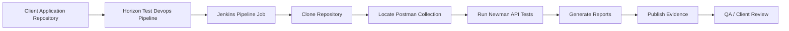

# Horizon Relevance Newman/API Test Framework

## Table of Contents

1. [Introduction](#introduction)
2. [Purpose](#purpose)
3. [Supported Applications](#supported-applications)
4. [Benefits](#benefits)
5. [Framework Architecture](#framework-architecture)
6. [Required Inputs](#required-inputs)
7. [Repository Structure](#repository-structure)
8. [How to Prepare API Tests](#how-to-prepare-api-tests)
9. [How to Execute Through Horizon AI DevSecOps](#how-to-execute-through-horizon-ai-devsecops)
10. [What to Validate](#what-to-validate)
11. [Demo Walkthrough](#demo-walkthrough)
12. [Reports and Evidence](#reports-and-evidence)
13. [Enterprise Best Practices](#enterprise-best-practices)
14. [Troubleshooting](#troubleshooting)

## Introduction

Newman is the command-line runner for Postman collections. It allows teams to execute API test collections automatically as part of a CI/CD or DevSecOps pipeline.

In the Horizon Relevance AI DevSecOps platform, Newman/API testing is part of the **Test Devops Pipeline**. It validates that deployed application APIs behave correctly after an application has been built, containerized, pushed to a registry, and deployed to a target environment such as DEV, QA, or STAGE.

For example, after an Angular application is deployed to QA, Newman can validate the backend APIs used by that Angular UI, such as health checks, release metadata, signoff workflows, authentication-protected endpoints, and business APIs.

## Purpose

The purpose of Newman/API testing is to confirm that application APIs are working correctly in a real deployed environment.

We perform Newman/API testing to:

- Validate API availability after deployment.
- Confirm response status codes, payload structure, and business rules.
- Detect regressions before promotion to higher environments.
- Produce execution evidence for QA, audit, and release governance.
- Support automated quality gates in the DevSecOps lifecycle.
- Reduce manual API validation effort for QA and application teams.

Newman/API testing is especially useful because modern applications often separate the frontend UI from backend services. A UI may load successfully, but the API behind it may fail. Newman helps validate that backend behavior directly.

## Supported Applications

The Horizon Newman/API Test Framework can be used for any application that exposes HTTP or HTTPS APIs.

Supported application types include:

- Angular applications with backend APIs.
- React or other SPA applications with backend APIs.
- Spring Boot REST APIs.
- Node.js and Express APIs.
- WebComponent-based applications that call APIs.
- Microservices deployed on Kubernetes.
- Containerized applications deployed to EKS.
- Public, private, or internal APIs reachable from the Jenkins execution environment.

Newman/API testing is not limited to Angular. Angular is only one demo example. The same framework works for Spring Boot, Node.js, and enterprise microservices as long as the repository contains a valid Postman collection.

## Benefits

Key benefits for clients:

- **Automated API regression testing:** API tests run through the Horizon Test Devops Pipeline.
- **Environment-aware validation:** Tests can run against DEV, QA, STAGE, or other configured environments.
- **Client-controlled source and artifacts:** Test definitions live in the client repository.
- **Evidence generation:** JSON, JUnit XML, HTML, and summary reports are generated.
- **Release readiness:** API behavior is validated before promotion to production.
- **Governance-friendly:** Results can be stored in S3 and linked to Jenkins builds.
- **Tool abstraction:** Clients see API test results and remediation context without needing to manage the underlying execution engine directly.

## Framework Architecture

The Newman/API testing flow follows this model:



The application repository contains the API test assets. The Horizon product collects the required inputs from the UI, sends them to the backend, creates or updates the Jenkins job, and triggers the Test Devops Pipeline.

Jenkins then runs Newman using the selected collection, environment file, API base URL, timeout, and fail-on-error settings.

## Required Inputs

When executing Newman/API testing through the Horizon UI, provide these inputs in the **Test Devops Pipeline** form.

| Field | Description | Example |
| --- | --- | --- |
| Project Name | Application or service name | `acme-angular-main` |
| Project Type | Application type | `Angular`, `SpringBoot`, `NodeJs` |
| Repository Type | Source control type | `GitHub` |
| Repository URL | Git repository URL | `https://github.com/ankur1825/horizon-demo-angular.git` |
| Branch | Branch to test | `main` |
| Newman API Regression | Enables Newman/API test execution | Enabled |
| API Base URL | API endpoint tested by Newman | `https://qa.acme.com` |
| Postman Collection Path | Path inside repo | `tests/postman/horizon-demo-api.postman_collection.json` |
| Postman Environment Path | Environment file inside repo | `tests/postman/qa.postman_environment.json` |
| Iteration Data File | Optional test data file | `tests/postman/data/qa-signoff-data.json` |
| Timeout | Request timeout in milliseconds | `30000` |
| Fail Pipeline on Error | Whether failed API tests should fail the Jenkins build | Enabled |
| Target Environment | Environment being tested | `QA` |
| Artifact S3 Bucket | Bucket for reports/evidence | `acme-fintech-devsecops` |
| Notification Email | Email for pipeline notifications | `qa.engineer@client.com` |

## Repository Structure

Recommended client repository structure:

```text
application-repo/
├── Dockerfile
├── package.json / pom.xml / build.gradle
├── src/
├── server/
└── tests/
    └── postman/
        ├── application-api.postman_collection.json
        ├── dev.postman_environment.json
        ├── qa.postman_environment.json
        └── data/
            └── qa-test-data.json
```

For the Horizon Angular demo application, the structure is:

```text
tests/postman/
├── horizon-demo-api.postman_collection.json
├── dev.postman_environment.json
├── qa.postman_environment.json
└── data/
    └── qa-signoff-data.json
```

## How to Prepare API Tests

1. Create or export a Postman collection.
2. Store the collection under `tests/postman/`.
3. Create environment files for each target environment.
4. Use variables for base URLs instead of hardcoding URLs.
5. Add assertions for status codes, payload fields, and business rules.
6. Commit and push the test files to the application repository.

Recommended Postman variables:

| Variable | Purpose |
| --- | --- |
| `baseUrl` | Main application or API base URL |
| `apiBaseUrl` | API-specific base URL, when different from the UI URL |
| `token` | Optional authentication token |
| `environment` | DEV, QA, STAGE, or PROD |

Recommended API assertions:

- Status code is expected, such as `200`, `201`, or `400`.
- Response is valid JSON.
- Required fields exist.
- Health endpoint returns `UP` or equivalent.
- Business validation errors return expected messages.
- Response time stays within agreed limits.

## How to Execute Through Horizon AI DevSecOps

1. Log in to the Horizon Relevance platform.
2. Open [https://horizonrelevance.com/pipeline/](https://horizonrelevance.com/pipeline/).
3. Select **Test Devops Pipeline**.
4. Enter the project details:
   - Project Name
   - Project Type
   - Repository URL
   - Branch
5. Enable **Newman API Regression**.
6. Enter the API test configuration:
   - API Base URL
   - Postman Collection Path
   - Postman Environment Path
   - Optional Iteration Data File
   - Timeout
   - Fail Pipeline on Error
7. Select the target environment, such as `QA`.
8. Enter artifact bucket and notification settings.
9. Click **Create Test Pipeline**.
10. Open the generated Jenkins job.
11. Monitor the Newman/API test stage.
12. Review generated reports and pipeline status.

## What to Validate

After the Test Devops Pipeline completes, validate the following items.

| Validation Area | Expected Result |
| --- | --- |
| Jenkins job creation | A test pipeline job is created or updated |
| Repository checkout | Correct repo and branch are cloned |
| Collection discovery | Postman collection path is found |
| Environment file | Correct environment file is used |
| API base URL | Newman points to the intended DEV/QA/STAGE endpoint |
| Newman execution | API tests run successfully |
| Failed tests | Failures are shown clearly in Jenkins logs |
| JUnit report | `results.xml` is generated |
| JSON report | `results.json` is generated |
| HTML report | `html/index.html` is generated |
| Summary report | `summary.json` is generated |
| Evidence upload | Reports are stored or available as pipeline artifacts |
| Notification | Email/SNS notification is sent if enabled |

## Demo Walkthrough

Use this demo when presenting the Newman/API framework to a client.

### Demo Application

Repository:

```text
https://github.com/ankur1825/horizon-demo-angular.git
```

Project type:

```text
Angular
```

Branch:

```text
main
```

### Demo API Endpoints

The demo application includes a real backend API used by the Angular UI.

| Endpoint | Purpose |
| --- | --- |
| `GET /api/health` | Validates service availability |
| `GET /api/release` | Returns release/version metadata |
| `GET /api/quality-gates` | Returns quality gate status |
| `POST /api/signoff` | Submits QA signoff |

### Demo Newman Files

| File | Purpose |
| --- | --- |
| `tests/postman/horizon-demo-api.postman_collection.json` | API regression collection |
| `tests/postman/qa.postman_environment.json` | QA environment values |
| `tests/postman/dev.postman_environment.json` | DEV environment values |
| `tests/postman/data/qa-signoff-data.json` | Optional iteration data |

### Demo Execution

In the Horizon UI:

1. Select **Test Devops Pipeline**.
2. Enter the Angular demo repository URL.
3. Select `Angular` as project type.
4. Enable **Newman API Regression**.
5. Set collection path:

```text
tests/postman/horizon-demo-api.postman_collection.json
```

6. Set environment path:

```text
tests/postman/qa.postman_environment.json
```

7. Set API Base URL to the deployed QA application URL.
8. Submit the pipeline.
9. Validate Jenkins logs and generated Newman reports.

## Reports and Evidence

The Horizon Newman/API framework generates the following evidence:

```text
reports/newman/
├── results.xml
├── results.json
├── summary.json
├── newman-command.txt
└── html/
    └── index.html
```

Report usage:

| Report | Consumer | Purpose |
| --- | --- | --- |
| `results.xml` | Jenkins / QA tools | JUnit-compatible test results |
| `results.json` | Automation / dashboards | Detailed Newman execution data |
| `summary.json` | Horizon findings view | High-level status and metadata |
| `html/index.html` | QA / client teams | Human-readable execution report |
| `newman-command.txt` | Audit / debugging | Captures sanitized execution command |

For enterprise clients, these reports should be stored in the configured artifact S3 bucket and linked back to the Jenkins build number.

## Enterprise Best Practices

Recommended enterprise practices:

- Keep API tests in the same repository as the application or service.
- Use environment files for DEV, QA, STAGE, and PROD.
- Never hardcode secrets in Postman collections.
- Store tokens and credentials in Jenkins credentials or client secret managers.
- Use `Fail Pipeline on Error` for QA and release gates.
- Start with smoke tests, then expand into regression coverage.
- Keep test names clear and business-readable.
- Validate both happy path and negative scenarios.
- Upload results to S3 for audit and release traceability.
- Use separate source and target AWS roles when testing or promoting across accounts.

Recommended test categories:

| Category | Example |
| --- | --- |
| Health | `/api/health` returns service status |
| Metadata | `/api/release` returns version and image information |
| Business API | Submit order, create request, update workflow |
| Negative Test | Invalid input returns `400` |
| Auth Test | Protected endpoint rejects missing token |
| Contract Test | Response schema contains required fields |
| Performance Smoke | Response time below threshold |

## Troubleshooting

| Issue | Common Cause | Resolution |
| --- | --- | --- |
| Collection not found | Wrong collection path | Verify file exists under `tests/postman/` |
| Environment not applied | Wrong environment path | Use `qa.postman_environment.json` or pass explicit path |
| API connection failed | API Base URL unreachable from Jenkins | Confirm service URL, ingress, DNS, and network access |
| Tests fail with 404 | Wrong endpoint or app not deployed | Validate app URL in browser and API URL with curl |
| Auth failures | Missing token or credentials | Use Jenkins credentials or environment variables |
| Pipeline does not fail despite test errors | Fail-on-error disabled | Enable **Fail pipeline when Newman tests fail** |
| Reports missing | Stage failed before report generation | Check Jenkins logs and workspace report directory |
| S3 upload failed | Bucket or IAM permissions missing | Confirm artifact bucket exists and role has write access |

## Client Demo Summary

For a client demo, explain the flow in this order:

1. The client owns the application repository.
2. The repository includes API test definitions under `tests/postman/`.
3. Horizon deploys or targets the application in QA.
4. The Test Devops Pipeline runs Newman against the deployed endpoint.
5. Results are generated as JUnit, JSON, HTML, and summary evidence.
6. Failed API behavior blocks promotion if the quality gate is enabled.
7. Reports are available for QA review, audit, and release traceability.

This demonstrates that Horizon Relevance can validate application behavior without taking ownership of the client source code or exposing internal scanning implementation details.
