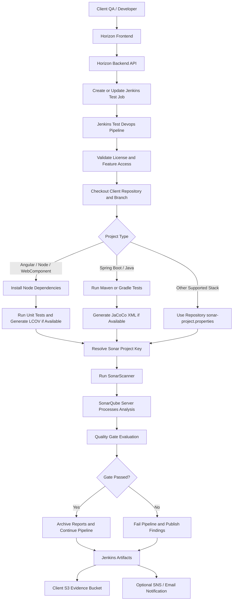
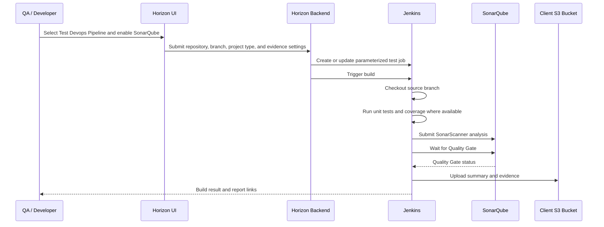

# Horizon Relevance SonarQube Code Quality and SAST Framework

## Table of Contents

1. [Introduction](#introduction)
2. [Purpose](#purpose)
3. [Supported Applications](#supported-applications)
4. [Benefits](#benefits)
5. [Framework Architecture](#framework-architecture)
6. [What SonarQube Validates](#what-sonarqube-validates)
7. [Required Inputs](#required-inputs)
8. [Repository Requirements](#repository-requirements)
9. [How Horizon Executes SonarQube Testing](#how-horizon-executes-sonarqube-testing)
10. [How to Execute Through Horizon AI DevSecOps](#how-to-execute-through-horizon-ai-devsecops)
11. [Angular Demo Walkthrough](#angular-demo-walkthrough)
12. [Spring Boot Demo Walkthrough](#spring-boot-demo-walkthrough)
13. [What to Validate](#what-to-validate)
14. [Reports and Evidence](#reports-and-evidence)
15. [Enterprise Best Practices](#enterprise-best-practices)
16. [Troubleshooting](#troubleshooting)
17. [Client Demo Summary](#client-demo-summary)

## Introduction

SonarQube is a code quality, security, and static application security testing platform. It analyzes application source code and identifies issues such as bugs, vulnerabilities, code smells, duplicated code, weak maintainability, and missing test coverage.

In the Horizon Relevance AI DevSecOps platform, SonarQube testing runs as part of the **Test Devops Pipeline**. It helps clients validate code quality and security posture before promoting application artifacts across environments such as DEV, QA, STAGE, and PROD.

SonarQube is not a runtime API test. It is a source-code analysis and quality gate tool. It answers questions like:

- Is the code secure enough to move forward?
- Does the code meet quality expectations?
- Are there vulnerabilities or maintainability risks?
- Is unit-test coverage available and acceptable?
- Did the build pass the configured SonarQube Quality Gate?

## Purpose

The purpose of SonarQube testing is to identify code-level risk before application release.

We perform SonarQube testing to:

- Detect security vulnerabilities during QA and release validation.
- Identify bugs, code smells, and maintainability issues.
- Validate unit-test coverage when coverage reports are available.
- Enforce quality gates before deployment or promotion.
- Produce release evidence for audit, governance, and client review.
- Give developers actionable remediation guidance.
- Support enterprise DevSecOps practices without requiring Horizon Relevance to own client source code.

## Supported Applications

The Horizon SonarQube framework supports applications that can be analyzed by SonarQube Scanner.

Supported application types include:

- Angular applications.
- Node.js applications.
- WebComponent applications.
- Spring Boot applications.
- Spring Boot Java 11 applications.
- Java Maven applications.
- Java Gradle applications.
- TypeScript and JavaScript frontends.
- Containerized applications whose source repository is available to the pipeline.

The framework can be extended for additional stacks such as Python, .NET, Go, and Terraform/IaC scanning when those language analyzers and repository conventions are defined.

## Benefits

Key benefits for enterprise clients:

- **Automated SAST:** Static security analysis runs from the Test Devops Pipeline.
- **Quality Gate enforcement:** Builds fail when SonarQube Quality Gate is not met.
- **Coverage support:** Angular/JavaScript LCOV and Spring Boot JaCoCo reports can be imported.
- **Client-owned source:** Source code remains in the client repository.
- **Audit evidence:** Reports and summaries are archived in Jenkins and can be uploaded to S3.
- **Repeatable governance:** The same checks can be applied across teams, branches, and applications.
- **Developer remediation:** Findings include issue locations and severity to support faster fixes.

## Framework Architecture

SonarQube testing in Horizon is a source-code quality and SAST validation workflow. It does not test a running URL like Selenium, Newman, or JMeter. Instead, it checks out the client repository inside the client-controlled Jenkins execution environment, prepares test coverage where possible, runs SonarScanner, and evaluates the configured SonarQube Quality Gate.



### Component Responsibilities

| Component | Responsibility |
| --- | --- |
| Horizon Frontend | Collects project, repository, environment, and SonarQube enablement inputs |
| Horizon Backend API | Validates request, applies license controls, creates or updates Jenkins job parameters |
| Jenkins Test Devops Pipeline | Executes checkout, coverage preparation, SonarScanner, quality gate, and evidence publishing |
| Client Repository | Holds application source, tests, coverage configuration, and optional `sonar-project.properties` |
| SonarQube Server | Stores analysis results, applies quality profiles, and evaluates Quality Gate policy |
| Client S3 Bucket | Stores release evidence, summaries, and reports for audit and QA signoff |
| Notification Channel | Sends success or failure notification when enabled |

### Source-Code Security Boundary

For enterprise clients, source code remains inside the client-controlled execution boundary. Horizon does not require clients to upload source code to Horizon Relevance. In a client-hosted deployment, Jenkins, SonarQube, credentials, artifact buckets, and network routes all run in the client environment.

### SonarQube Data Flow

1. User submits a Test Devops Pipeline request with **SonarQube Code Quality** enabled.
2. Horizon backend creates or updates a Jenkins job with repository, branch, project type, and evidence settings.
3. Jenkins clones the requested branch using client-controlled Git credentials.
4. Jenkins detects the stack and prepares coverage:
   - Angular/Node/WebComponent: Node dependency install and LCOV generation when supported.
   - Spring Boot/Maven: Maven test execution and JaCoCo XML generation.
   - Spring Boot/Gradle: Gradle test execution and JaCoCo XML generation.
5. Jenkins uses repository-provided `sonar-project.properties` when available; otherwise it generates a sane project key and scanner configuration.
6. SonarScanner sends metadata, source analysis, and coverage paths to SonarQube.
7. Jenkins waits for SonarQube Quality Gate status.
8. If the Quality Gate fails, the pipeline fails and publishes evidence.
9. If the Quality Gate passes, the pipeline archives results and continues to the next selected test.

### Enterprise Quality Gate Model

The Quality Gate should be configured differently by environment and maturity:

| Environment | Recommended Gate Style | Example |
| --- | --- | --- |
| DEV | Developer feedback | Warn on coverage, fail on critical vulnerabilities |
| QA | Release validation | Fail on blocker/critical issues and major coverage regression |
| STAGE | Pre-production control | Fail on unresolved vulnerabilities, low coverage, duplicated code |
| PROD promotion | Governance gate | Require clean Quality Gate or approved waiver |

### Execution Flow Through Horizon Product



## What SonarQube Validates

SonarQube can validate several quality and security dimensions.

| Area | Description |
| --- | --- |
| Bugs | Code patterns likely to cause incorrect behavior |
| Vulnerabilities | Security weaknesses in application code |
| Security Hotspots | Code that requires security review |
| Code Smells | Maintainability and readability issues |
| Duplication | Repeated code blocks |
| Coverage | Unit-test coverage from LCOV or JaCoCo reports |
| Complexity | Complex methods, classes, or functions |
| Quality Gate | Pass/fail policy based on configured thresholds |

## Required Inputs

When running SonarQube through the Horizon UI, provide these values in the **Test Devops Pipeline** form.

| Field | Description | Example |
| --- | --- | --- |
| Service | Pipeline type | `Test Devops Pipeline` |
| Project Name | Unique app/test pipeline name | `Acme-angular-main-ank-test` |
| Project Type | Application stack | `Angular` or `SpringBoot` |
| Repository Type | Source provider | `GitHub` |
| Repository URL | Client application repository | `https://github.com/ankur1825/horizon-demo-angular.git` |
| Branch | Branch to scan | `main` |
| SonarQube Code Quality | Enables SonarQube scan | Enabled |
| Target Environment | Environment context | `QA` |
| Artifact S3 Bucket | Optional evidence bucket | `acme-fintech-devsecops` |
| Notification Email | Optional owner email | `qa.engineer@client.com` |

Optional advanced values may include:

- Sonar project key.
- Sonar project name.
- Custom quality gate policy.
- Custom `sonar-project.properties` in the client repository.

## Repository Requirements

The client repository should contain normal application source code and build files.

### Angular / Node / WebComponent

Recommended structure:

```text
application-repo/
├── package.json
├── package-lock.json
├── angular.json
├── tsconfig.json
├── src/
│   └── app/
│       ├── app.component.ts
│       └── app.component.spec.ts
└── tests/
```

Recommended package scripts:

```json
{
  "scripts": {
    "test": "ng test",
    "test:coverage": "ng test --watch=false --browsers=ChromeHeadless --code-coverage"
  }
}
```

For Angular coverage, the Jenkins runtime must have Chrome or Chromium available. If Chrome is unavailable, SonarQube can still run static code analysis, but LCOV coverage will not be produced.

### Spring Boot

Recommended structure:

```text
application-repo/
├── pom.xml
├── src/
│   ├── main/java/
│   └── test/java/
```

Recommended Maven coverage plugin:

```xml
<plugin>
  <groupId>org.jacoco</groupId>
  <artifactId>jacoco-maven-plugin</artifactId>
  <version>0.8.12</version>
  <executions>
    <execution>
      <goals>
        <goal>prepare-agent</goal>
      </goals>
    </execution>
    <execution>
      <id>report</id>
      <phase>verify</phase>
      <goals>
        <goal>report</goal>
      </goals>
    </execution>
  </executions>
</plugin>
```

## How Horizon Executes SonarQube Testing

The Horizon Test Devops Pipeline performs the following steps:

1. Validates enterprise license and requested feature access.
2. Cleans the Jenkins workspace.
3. Checks out the requested application repository and branch.
4. Prepares the test context.
5. Runs coverage preparation:
   - Angular/Node/WebComponent: `npm ci` and `npm run test:coverage` when available.
   - Spring Boot/Maven: `mvn -B clean verify`.
   - Spring Boot/Gradle: `gradle clean test jacocoTestReport`.
6. Reads repository-provided `sonar-project.properties`, if present.
7. Generates `sonar-project.properties` automatically when the repo does not provide one.
8. Runs SonarScanner against SonarQube.
9. Waits for SonarQube Compute Engine processing to complete.
10. Reads the SonarQube Quality Gate result.
11. Fails the build if the Quality Gate fails.
12. Archives SonarQube evidence in Jenkins.
13. Uploads evidence to S3 when `ARTIFACT_BUCKET` is configured.

## How to Execute Through Horizon AI DevSecOps

1. Log in to the Horizon Relevance platform.
2. Open [https://horizonrelevance.com/pipeline/](https://horizonrelevance.com/pipeline/).
3. Select **Test Devops Pipeline**.
4. Enter project details:
   - Project Name
   - Project Type
   - Repository URL
   - Branch
5. Enable **SonarQube Code Quality**.
6. Disable other tools if the goal is a focused SonarQube demo.
7. Select target environment, such as `QA`.
8. Add artifact bucket if evidence upload is required.
9. Click **Create Test Pipeline**.
10. Open the generated Jenkins job.
11. Monitor the **Code Quality Analysis** stage.
12. Validate Quality Gate status and archived reports.

## Angular Demo Walkthrough

Demo repository:

```text
https://github.com/ankur1825/horizon-demo-angular.git
```

Recommended UI values:

| Field | Value |
| --- | --- |
| Project Name | `Acme-angular-main-ank-test` |
| Project Type | `Angular` |
| Repository URL | `https://github.com/ankur1825/horizon-demo-angular.git` |
| Branch | `main` |
| SonarQube Code Quality | Enabled |
| Target Environment | `QA` |

Expected behavior:

- Jenkins checks out the Angular repository.
- Jenkins installs Node dependencies.
- Jenkins attempts to run Angular coverage.
- SonarScanner analyzes TypeScript, JavaScript, CSS, and HTML files.
- SonarQube Quality Gate is evaluated.
- Reports are archived under `reports/sonarqube/`.

Important demo note:

If Jenkins does not have Chrome/Chromium installed, Angular coverage will not produce LCOV. The SonarQube static analysis and Quality Gate can still succeed. For full Angular coverage, the Jenkins image should include Chrome/Chromium or the pipeline should run Angular tests in a dedicated Node+Chrome test container.

## Spring Boot Demo Walkthrough

Demo repository:

```text
https://github.com/ankur1825/horizon-demo-springboot.git
```

Recommended UI values:

| Field | Value |
| --- | --- |
| Project Name | `Acme-springboot-sonar-test` |
| Project Type | `SpringBoot` |
| Repository URL | `https://github.com/ankur1825/horizon-demo-springboot.git` |
| Branch | `main` |
| SonarQube Code Quality | Enabled |
| Target Environment | `QA` |
| Artifact S3 Bucket | `acme-fintech-devsecops` |

Expected behavior:

- Jenkins checks out the Spring Boot repository.
- Jenkins runs Maven tests.
- JaCoCo creates a coverage report.
- SonarScanner imports Java classes, test reports, and JaCoCo coverage.
- SonarQube Quality Gate is evaluated.
- Reports are archived in Jenkins.
- Reports are uploaded to S3 when bucket is provided.

Validated demo result:

```text
Jenkins job: Acme-springboot-sonar-test-test
Build: #2
Result: SUCCESS
Quality Gate: OK
Evidence path:
s3://acme-fintech-devsecops/test-devops-pipeline/Acme-springboot-sonar-test/2/sonarqube/
```

## What to Validate

After execution, validate the following.

| Validation Area | Expected Result |
| --- | --- |
| Jenkins job creation | Test pipeline job exists |
| Repository checkout | Correct repo and branch are checked out |
| Coverage preparation | Coverage command runs or gracefully skips |
| Sonar config | `sonar-project.properties` is present |
| SonarScanner | Analysis submits successfully |
| Compute Engine | SonarQube processing completes |
| Quality Gate | Status is `OK` for passing builds |
| Jenkins artifacts | `reports/sonarqube/**` archived |
| S3 evidence | Reports uploaded when bucket is configured |
| Findings | Issues are available in SonarQube and processed by Horizon findings flow |

## Reports and Evidence

Horizon archives SonarQube evidence in Jenkins.

```text
reports/sonarqube/
├── sonar-project.properties
├── quality-gate.json
├── compute-engine-task.json
├── analysis-id.txt
├── issues.json
├── ai-sonar-results.json
└── summary.json
```

Report usage:

| Report | Purpose |
| --- | --- |
| `sonar-project.properties` | Exact scanner configuration |
| `quality-gate.json` | Quality Gate result from SonarQube |
| `compute-engine-task.json` | SonarQube processing status |
| `analysis-id.txt` | Analysis ID used for Quality Gate lookup |
| `issues.json` | Raw SonarQube issues |
| `ai-sonar-results.json` | Horizon-normalized findings output |
| `summary.json` | High-level execution metadata |

When an artifact bucket is configured, reports are uploaded to:

```text
s3://<artifact-bucket>/test-devops-pipeline/<project-name>/<build-number>/sonarqube/
```

## Enterprise Best Practices

Recommended enterprise practices:

- Run SonarQube in the Test Devops Pipeline before production promotion.
- Use Quality Gates as a release control.
- Keep tests and coverage configuration in the application repository.
- Provide a repository-owned `sonar-project.properties` for complex projects.
- Use unique Sonar project keys per application and branch strategy.
- Treat new critical vulnerabilities as release blockers.
- Store Jenkins and Sonar evidence in client-owned S3.
- Keep SonarQube findings visible to developers and QA reviewers.
- Use separate Sonar projects for major applications or domains.
- Do not hardcode secrets in source code or Sonar configuration.

Recommended Quality Gate checks:

| Metric | Typical Enterprise Policy |
| --- | --- |
| New vulnerabilities | 0 critical/high |
| New bugs | 0 blocker/critical |
| Security hotspots | Reviewed before release |
| New code coverage | Minimum threshold per client policy |
| Duplicated lines | Below agreed threshold |
| Maintainability rating | A or B |
| Reliability rating | A |
| Security rating | A |

## Troubleshooting

| Issue | Common Cause | Resolution |
| --- | --- | --- |
| `sonar-project.properties not found` | Older pipeline required repo config | Current framework auto-generates it |
| SonarScanner not found | Jenkins image missing scanner | Install scanner in Jenkins image or init container |
| Quality Gate failed | Code violates Sonar policy | Review SonarQube dashboard and fix issues |
| Angular LCOV missing | Chrome/Chromium missing in Jenkins | Add Chrome to Jenkins image or use Node+Chrome test container |
| Java binaries error | Build output directory missing | Ensure Maven/Gradle build runs before scanner |
| JaCoCo not imported | Missing JaCoCo XML report | Add JaCoCo plugin and run `mvn verify` |
| S3 upload failed | Bucket or IAM issue | Confirm bucket exists and Jenkins role has write permission |
| SonarQube unreachable | DNS/service/ingress issue | Validate `SONAR_HOST_URL` from Jenkins pod |
| Auth failure | Missing or invalid Sonar token | Validate `SONAR_TOKEN` secret |

## Client Demo Summary

For a client-facing demo, present the flow like this:

1. The client owns the application source repository.
2. Horizon Test Devops Pipeline checks out the selected branch.
3. The pipeline prepares coverage where supported.
4. SonarScanner analyzes source code.
5. SonarQube evaluates bugs, vulnerabilities, code smells, and coverage.
6. Horizon enforces the Quality Gate.
7. Evidence is archived in Jenkins and optionally uploaded to client S3.
8. Client teams use SonarQube findings to remediate code before promotion.

This demonstrates that Horizon Relevance can perform enterprise-grade code quality and SAST validation while keeping source code and evidence under the client’s control.
